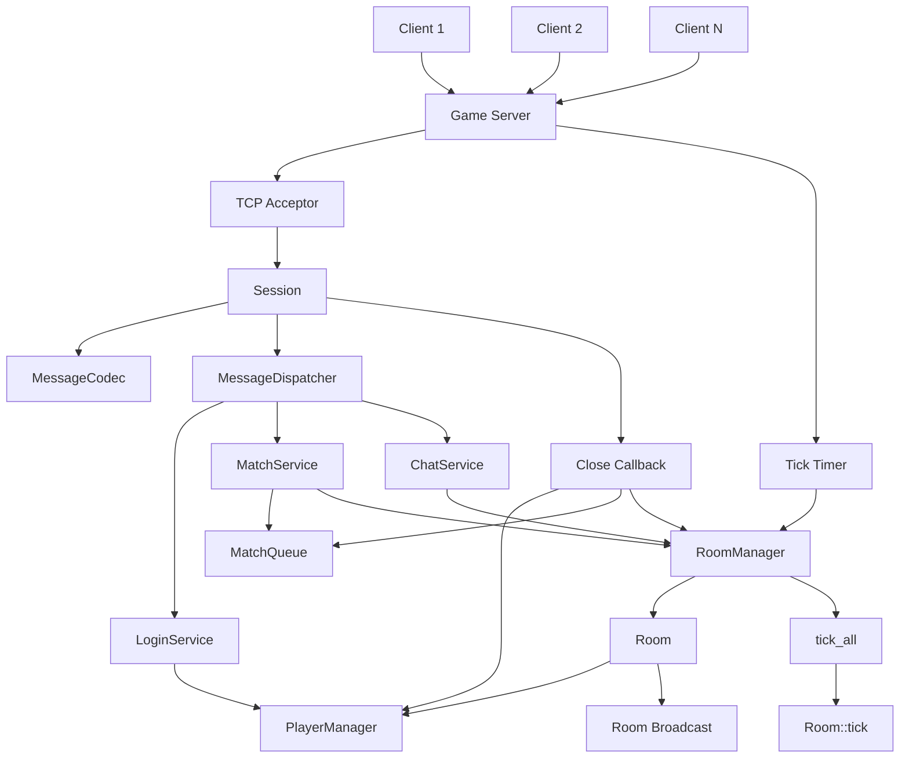
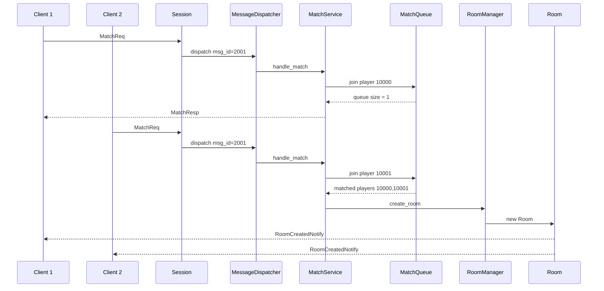
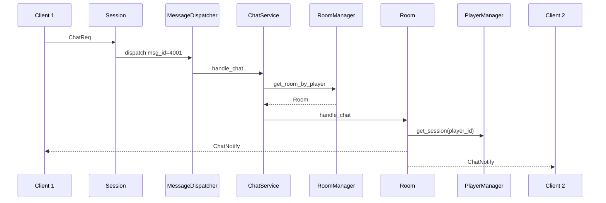
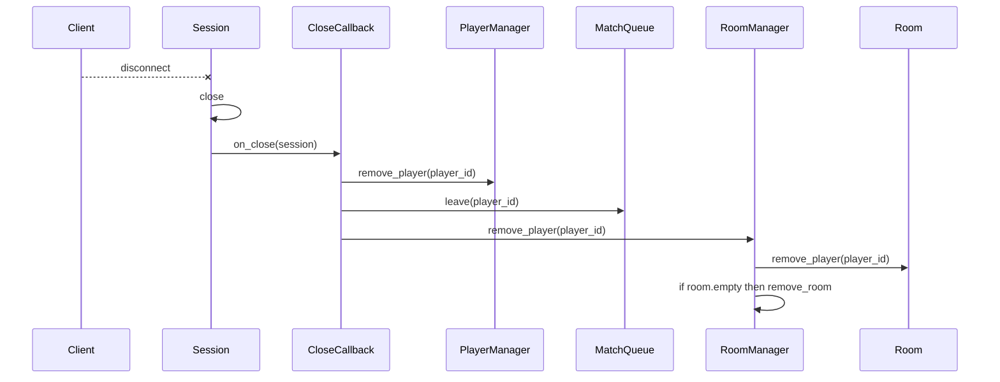

# 架构设计文档

## 一、项目定位

本项目是一个基于 C++ / Boost.Asio 的房间制游戏服务器 Demo。

核心目标是实现一个可运行、可压测、可讲解的游戏服务器 v1，覆盖以下核心链路：

```text
TCP 连接
  -> 消息编解码
  -> 消息分发
  -> 登录模拟
  -> 在线玩家管理
  -> 匹配队列
  -> 房间创建
  -> 房间广播
  -> 聊天同步
  -> 房间 Tick
  -> 断线清理
```

---

## 二、整体架构图



---

## 三、分层设计

项目主要分为 5 层：

```text
网络层
协议层
分发层
业务层
状态管理层
```

---

## 四、网络层

### 1. Acceptor

`tcp::acceptor` 负责监听客户端连接。

流程：

```text
acceptor.async_accept()
  -> 创建 Session
  -> 设置 close_callback
  -> session.start()
  -> 继续 do_accept()
```

职责：

* 监听端口
* 接收客户端连接
* 创建 Session
* 维持 accept 循环

---

### 2. Session

`Session` 表示一个客户端连接。

核心职责：

* 维护 socket
* 异步读取 TCP 数据
* 异步发送 TCP 数据
* 保存接收缓冲区
* 保存发送队列
* 保存 player_id
* 连接关闭时触发 close_callback

主要成员：

```cpp
tcp::socket socket_;
MessageDispatcher& dispatcher_;

std::array<char, 4096> read_buffer_;
std::vector<char> recv_buffer_;
std::deque<std::vector<char>> write_queue_;

int player_id_ = 0;
bool closed_ = false;
CloseCallback close_callback_;
```

读取流程：

```text
async_read_some
  -> append 到 recv_buffer_
  -> MessageCodec::try_decode
  -> 成功解析 Message
  -> MessageDispatcher::dispatch
  -> 继续 do_read
```

发送流程：

```text
Session::send
  -> MessageCodec::encode
  -> push 到 write_queue_
  -> 如果当前没有写任务，启动 do_write
  -> async_write 队首数据
  -> 写完 pop_front
  -> 如果队列不空，继续 do_write
```

设计原因：

* TCP 是流式协议，一次 read 不一定是一条完整消息。
* `recv_buffer_` 用于累积 TCP 字节流。
* `write_queue_` 用于保证同一个 socket 上的发送顺序。
* `shared_from_this()` 用于保证异步回调期间 Session 生命周期有效。

---

## 五、协议层

### MessageCodec

`MessageCodec` 负责把业务消息和 TCP 字节流互相转换。

协议格式：

```text
| body_len: uint32_t | msg_id: uint16_t | body: protobuf bytes |
```

其中：

```text
body_len   4 字节，网络字节序
msg_id     2 字节，网络字节序
body       Protobuf 序列化后的二进制数据
```

核心接口：

```cpp
static std::vector<char> encode(const Message& message);

static DecodeStatus try_decode(
    std::vector<char>& buffer,
    Message& out_message,
    std::string* error_message = nullptr
);
```

`try_decode()` 返回状态：

```text
Success   成功解析出一条完整消息
NeedMore  数据不够，需要继续读取
Error     数据非法
```

### 粘包 / 拆包处理

由于 TCP 是字节流，可能出现：

```text
一次 read 收到半包
一次 read 收到多包
一次 read 收到一包半
```

因此服务端不会直接把一次 read 当成一条消息，而是：

```text
读取数据
  -> append 到 recv_buffer_
  -> while 循环 try_decode
  -> 成功解析一条就从 buffer erase
  -> NeedMore 时停止解析
```

---

## 六、分发层

### MessageDispatcher

`MessageDispatcher` 负责根据 `msg_id` 调用对应业务处理函数。

核心结构：

```cpp
std::unordered_map<uint16_t, Handler> handlers_;
```

核心接口：

```cpp
void register_handler(uint16_t msg_id, Handler handler);
void dispatch(SessionPtr session, const Message& message);
```

注册示例：

```cpp
dispatcher.register_handler(
    MSG_LOGIN_REQ,
    [&login_service](std::shared_ptr<Session> session, const Message& message) {
        login_service.handle_login(session, message);
    }
);
```

设计好处：

* 网络层不关心业务逻辑。
* 业务逻辑通过 handler 注册。
* 后续新增协议只需要新增 handler。

---

## 七、业务层

### 1. LoginService

负责模拟登录。

流程：

```text
收到 LoginReq
  -> 解析 username
  -> 生成 player_id
  -> session.set_player_id(player_id)
  -> PlayerManager.add_player(player_id, session)
  -> 返回 LoginResp
```

职责：

* 登录请求处理
* 生成玩家 ID
* 绑定 player_id 和 Session
* 发送登录响应

当前版本没有接数据库，属于模拟登录。

---

### 2. MatchService

负责处理匹配请求。

流程：

```text
收到 MatchReq
  -> 检查 session.player_id
  -> MatchQueue.join(player_id)
  -> 返回 MatchResp
  -> MatchQueue.try_pop_matched_players(2)
  -> RoomManager.create_room(players)
```

职责：

* 检查玩家是否登录
* 加入匹配队列
* 触发房间创建

---

### 3. ChatService

负责处理聊天请求。

流程：

```text
收到 ChatReq
  -> 获取 session.player_id
  -> RoomManager.get_room_by_player(player_id)
  -> Room.handle_chat(player_id, text)
  -> Room.broadcast(ChatNotify)
```

职责：

* 解析聊天请求
* 查找玩家所在房间
* 调用房间广播

---

## 八、状态管理层

### 1. PlayerManager

负责在线玩家管理。

核心结构：

```cpp
std::unordered_map<int, std::weak_ptr<Session>> players_;
```

职责：

* 添加在线玩家
* 移除在线玩家
* 根据 player_id 获取 Session
* 查询在线人数

使用 `weak_ptr<Session>` 的原因：

* PlayerManager 不应该强持有 Session。
* Session 生命周期由连接和异步回调控制。
* 客户端断线后 Session 应该可以正常释放。

---

### 2. MatchQueue

负责匹配队列。

核心结构：

```cpp
std::deque<int> queue_;
std::unordered_set<int> in_queue_;
```

职责：

* 玩家加入匹配
* 玩家离开匹配
* 防止重复加入
* 队列人数达到房间人数后弹出一组玩家

使用 `player_id` 而不是 `Session` 的原因：

* MatchQueue 不负责连接生命周期。
* 防止队列强持有 Session。
* 真正发消息时通过 PlayerManager 查找连接。

---

### 3. RoomManager

负责房间生命周期管理。

核心结构：

```cpp
std::unordered_map<int, std::shared_ptr<Room>> rooms_;
std::unordered_map<int, int> player_room_map_;
```

职责：

* 创建房间
* 删除房间
* 根据 room_id 查找房间
* 根据 player_id 查找房间
* 维护 player_id -> room_id 映射
* 玩家断线时从房间移除
* 房间为空时销毁房间
* 驱动所有房间 Tick

---

### 4. Room

负责单个房间内部逻辑。

核心结构：

```cpp
int room_id_;
std::vector<int> player_ids_;
PlayerManager& player_manager_;
uint64_t tick_count_;
```

职责：

* 保存房间玩家
* 判断玩家是否在房间中
* 添加 / 移除玩家
* 房间广播
* 聊天处理
* Tick 更新

Room 广播时不直接保存 Session，而是：

```text
Room 保存 player_id
  -> PlayerManager.get_session(player_id)
  -> session.send(message)
```

这样可以避免 Room 强持有 Session。

---

## 九、房间创建流程



---

## 十、聊天广播流程



---

## 十一、断线清理流程



---

## 十二、Tick 设计

服务端使用 `boost::asio::steady_timer` 驱动 Tick。

流程：

```text
start_tick()
  -> timer.expires_after(100ms)
  -> timer.async_wait()
  -> RoomManager.tick_all()
  -> start_tick()
```

Room Tick：

```text
Room::tick()
  -> tick_count_++
  -> 定期打印房间状态
```

当前 v1 中 Tick 只做日志输出，后续可以扩展为：

* 房间倒计时
* 玩家状态同步
* 技能冷却
* 战斗逻辑
* 游戏结束判断
* 房间自动销毁

---

## 十三、线程模型

当前 v1 采用单 `io_context` 事件循环。

```text
main thread
  -> io_context.run()
  -> accept
  -> read
  -> write
  -> timer
```

当前版本的业务逻辑基本在同一个事件循环中执行。

虽然部分 Manager 内部使用了 mutex，但 v1 的主要目的是保证后续扩展多线程时状态结构更安全。

后续可以扩展为：

```text
多个 io_context worker
房间逻辑单独线程
网络线程和逻辑线程分离
```

---

## 十四、压测结果

压测配置：

```text
客户端数量：50
房间人数：2
预期房间数量：25
```

峰值状态：

```text
[ServerStats] online=50 match_queue=0 room=25
```

全部断开后：

```text
[ServerStats] online=0 match_queue=0 room=0
```

说明：

```text
在线玩家正确统计
匹配队列无残留
房间数量正确
客户端断开后资源正常回收
```

---

## 十五、设计总结

当前架构完成了房间制游戏服务器的核心链路：

```text
Session 负责连接
MessageCodec 负责协议编解码
MessageDispatcher 负责协议分发
Service 负责业务逻辑
Manager 负责状态管理
Room 负责房间内广播和 Tick
```

该设计的重点是模块职责清晰，网络层和业务层解耦，后续可以继续扩展为更完整的游戏服务器架构。
